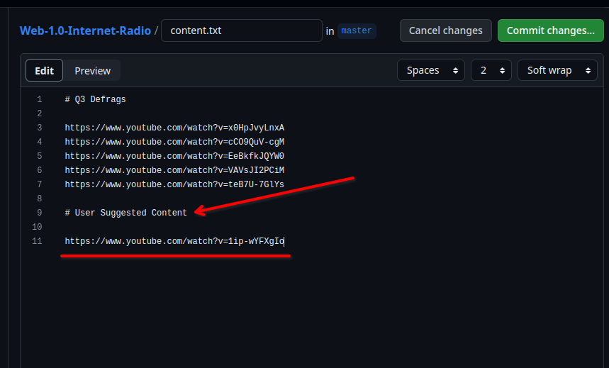
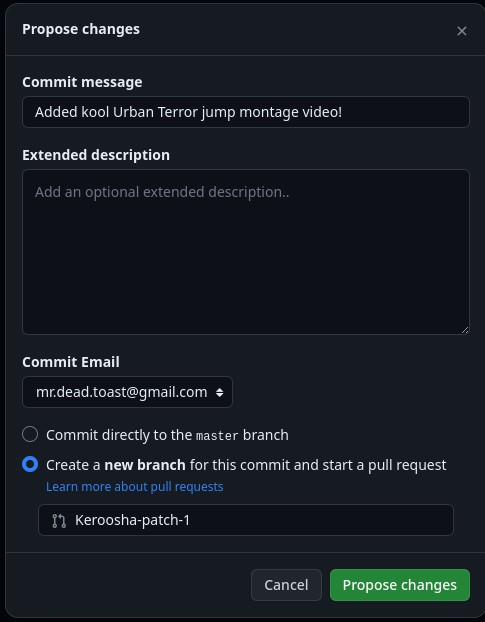
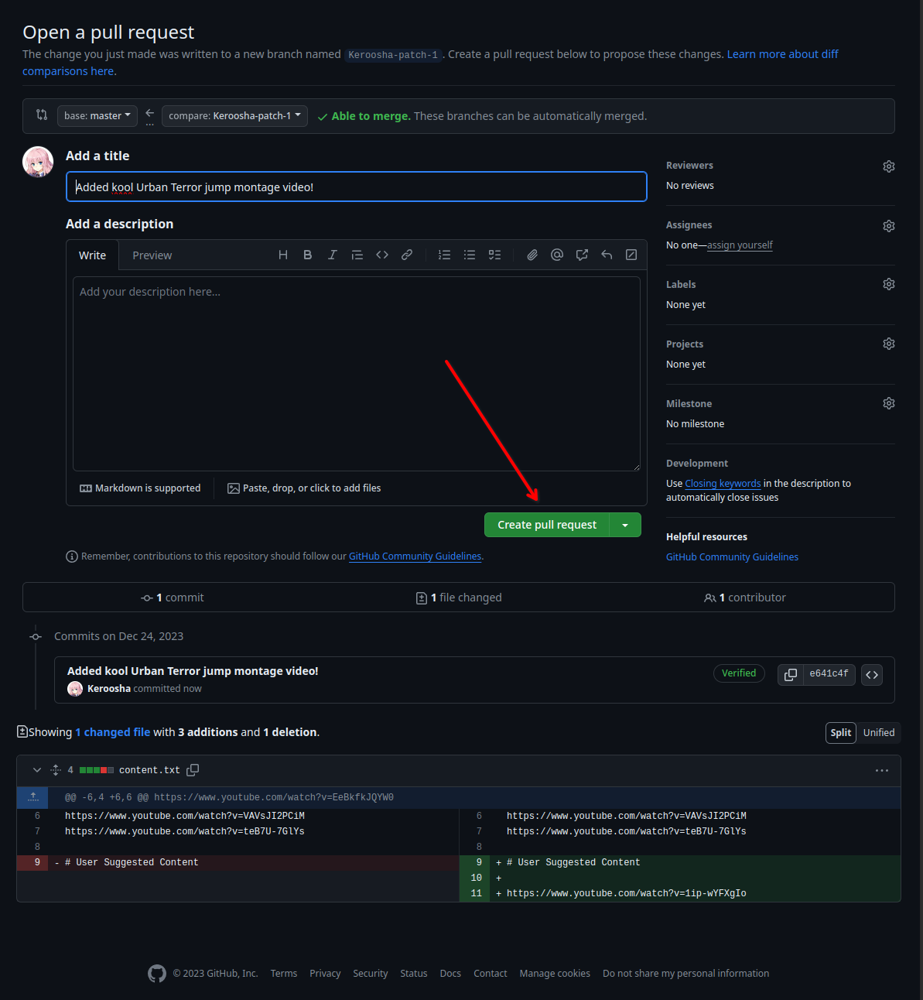

# Web 1.0 Internet Radio

Radio infrastructure for [Web 1.0 Telegram Channel](https://t.me/netscapedidnothingwrong)

## Content Suggestions

First of all make a [Github Account](https://github.com/signup) dude!

Open [Content.txt](https://github.com/Keroosha/Web-1.0-Internet-Radio/edit/master/content.txt) editor and place your content at *User Suggested Content* section



Then, press "Commit changes..." and fill the form describing what you added to content.txt and press "Propose changes"



And last step - Create pull request



Congratulations! You Won!

Now, wait until administrators review your PR and decide - merge it or not

## Nerdy stuff

### Requirements

- Docker
- Liquidsoap
- FFmpeg
- VSCode
  - vscode-liquidsoap plugin

### secrets.liq template

```
streamUrl = "REPLACE_ME"
streamKey = "REPLACE_ME"
```

### Usage

```bash

touch secrets.liq
echo 'streamUrl = "replace_me"' >> secrets.liq
echo 'streamKey = "replace_me"' >> secrets.liq

make all
```
